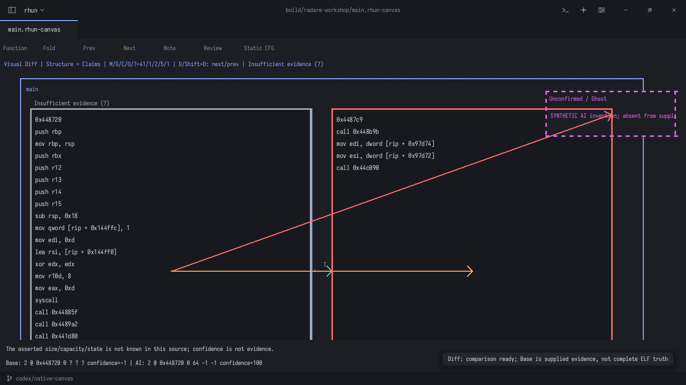
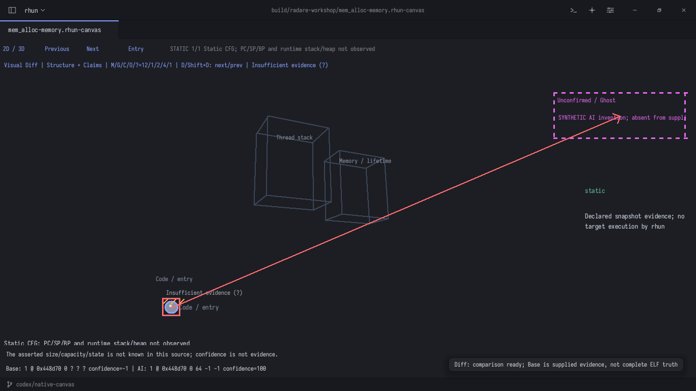

# Visual Diff: исходный граф и утверждения агента

Нативный слой сравнения реализован на ASM, без браузера и без запуска исследуемой
программы. Он сравнивает утверждения агента с **предоставленными исходными данными**.
Результат r2 может быть неполным; совпадение структуры не подтверждает смысл
произвольного объяснения. Режим полного семантического доказательства не реализован.

## Быстро посмотреть на вашем rhun

Из `/home/resu/Documents/dev/rhun`:

```sh
python3 tools/visual-diff-workshop.py --open cfg
```

Откроется сохранённый CFG `main` с намеренно ошибочным ответом. Для проекции
`mem_alloc` в Memory/3D:

```sh
python3 tools/visual-diff-workshop.py --open memory
```

Скрипт открывает окно с уже загруженным Diff и ждёт его закрытия. Если примеры ещё
не подготовлены, сначала запустите `python3 tools/visual-diff-workshop.py --native`.
Для подготовки требуются сцены из предыдущего `tools/radare-workshop.py`.
Просмотр готовых сцен и Diff не требует r2. Нужна актуальная сборка `build/rhun`;
старый установленный экземпляр не получит эти команды до обновления/перезапуска.



**Примеры ответов искусственные:** это контрольные правильный и ошибочный JSON,
а не полученный от облачной модели разбор. Они позволяют воспроизводимо проверить,
что интерфейс действительно обнаруживает заданные расхождения.

## 10. Цвета и смысл статусов

| Цвет / статус | Что установлено |
|---|---|
| Обычные цвета, `Structure matches` | Совпали идентичность и проверяемые утверждения; текст label не проверяется на истинность |
| Пурпурный пунктир, `Unconfirmed / Ghost` | Объект отсутствует в Base; его отсутствие во всём ELF этим не доказано |
| Красный, `Contradiction` | Адрес, известное свойство или известный переход расходится с утверждением агента |
| Оранжевая обводка со штриховкой, `Omitted in complete scope` | Объект/связь пропущены в ответе, объявленном полным внутри scope |
| Серый, `Insufficient evidence (?)` | Для проверки утверждения не хватает известных данных |

Вверху `M/G/C/O/?` — количества **элементов сравнения** в этом порядке.
Узлы и связи считаются отдельно; замена перехода может дать и неверную связь,
и пропущенную исходную связь. Это не число независимых ошибок или уязвимостей.
Фильтр меняет отображение/навигацию, но не полные счётчики или отчёт.

`confidence` — число, которое сообщил агент. Значение 100 не превращает неизвестное
в факт. `-1` означает, что уверенность не предоставлена. Цветовой карты уверенности
нет, чтобы не смешивать её с проверкой по источнику.

## 11. Что и когда нажимать

Сначала щёлкните по холсту. Команды вызываются через **Ctrl+Shift+P**, поиск по
названию, **Enter**. В поле пути удобно нажать **Ctrl+A**, вставить полный путь,
затем Enter.

| Действие | Команда / клавиша |
|---|---|
| Экспортировать исходную область и шаблон ответа | `Radare2 Diff: Export Agent Context` → путь `.json` |
| Загрузить структурированный ответ | `Radare2 Diff: Load Agent Claims` → путь `.json` |
| Следующее расхождение | **D** / `Radare2 Diff: Next Difference` |
| Предыдущее расхождение | **Shift+D** / `Radare2 Diff: Previous Difference` |
| Скрыть/показать слой | `Radare2 Diff: Toggle Overlay` |
| Переключить Structure / Structure + Claims | `Radare2 Diff: Toggle Structure Claims Filter` |
| Экспортировать полный отчёт | `Radare2 Diff: Export JSON Markdown Report` → `.json` или `.md` |
| Удалить текущее сравнение | `Radare2 Diff: Clear Comparison` |

**Ctrl+Shift+D сохранён за дублированием строки в редакторе.** Для Visual Diff
используйте палитру. D/Shift+D работают при загруженном сравнении и фокусе холста;
они не подменяют ввод текста в редактируемом элементе Canvas.

По умолчанию выбран **Structure**: адреса, типы объектов, узлы и связи.
Для размеров, ёмкости и состояния включите **Structure + Claims**.
Навигация пропускает совпадения и отфильтрованные утверждения, проходит по кругу.
Она выбирает исходный объект/сегмент; в 2D также перемещает холст к нему.
В 3D сохраняется управление камерой: средняя кнопка вращает, колесо масштабирует.

Внизу показаны причина и сравнение `Base / AI`. Для узла после адреса идут
`kind size capacity state`; `?` в Base означает неизвестное свойство,
`-1` в ответе — отсутствие утверждения. Полные записи есть в JSON/Markdown-отчёте.

## 12. Memory, 3D, свёртки и фантомы

- На Memory-вкладке **V** переключает 2D/3D, **F** сворачивает выбранный сегмент,
  **N / Entry** сбрасывает камеру.
- Одни и те же расхождения привязаны к одним исходным ID в обоих представлениях.
- Для скрытого узла маркер переносится на сводную карточку/узел сегмента.
  Внутренняя связь свёрнутого сегмента не становится новой внешней связью.
  Красная рамка имеет приоритет на сводном узле; подпись причины относится
  к выбранному расхождению, остальные доступны через D/Shift+D и отчёт.
- Ghost выводится в отдельной подписанной панели поверх сцены. Ему не присваиваются
  выдуманные адресные/мировые координаты. Панель показывает один фантом;
  переход D к другому фантомному узлу показывает его. Все фантомы остаются в отчёте.
- **[ / ]** меняют снимок и делают старое сравнение `STALE`. Для нового снимка
  нужно экспортировать соответствующий контекст и загрузить новый ответ.
- Изменение исходной сцены тоже делает Diff устаревшим. Поворот камеры, выбор,
  фильтрация и свёртки исходные данные не меняют.



Diff не меняет доказательства в `.rhun-canvas`. Само сравнение — временный слой:
для повторного открытия храните исходную сцену, Claims JSON и отчёт. Сохранение
сцены сохраняет исходные данные, а не автоматически принятый ответ модели.

## 13. Работа с настоящим агентом

1. Создайте **Chat: New OpenCode Conversation** или **Chat: New Codex Conversation**,
   дождитесь готовности настроенного CLI.
2. Вернитесь на нужный CFG или конкретный Memory Snapshot.
3. Выполните **Radare2 Diff: Send Current Scope to Ready Chat**.
   Отправляется структурный контекст текущей вкладки/снимка с инструкцией вернуть
   строгий JSON. В этом контексте нет полного ассемблера или автоматического
   анализа смыслов текста; дополнительный исходный материал передавайте явно.
4. Дождитесь полного завершения ответа. Попросите вернуть **голый JSON**
   `rhun-agent-claims`, без ```-обрамления и окружающей прозы.
5. На исходной вкладке выполните **Radare2 Diff: Compare Selected Chat Response**.
6. Введите номер ответа ассистента в **активном чате**, начиная с 1. Пользовательские
   сообщения и сообщения инструментов в этой нумерации не считаются.
7. Проверьте расхождения. Никакие изменения из ответа автоматически не принимаются.

Есть и файловый путь: экспорт контекста → явная передача файла агенту → сохранение
его ответа в JSON → **Load Agent Claims**. Лимит отправки в чат — 48 KiB; для
большего контекста используйте файл или меньшую исходную сцену. Импорт — до 1 MiB.
Произвольный Markdown не извлекается автоматически в доказанные узлы и связи.

В автоматических проверках использован тестовый ACP-провайдер. Реальный облачный
ответ для вашего ELF не запрашивался; работоспособность конкретной модели и её
соблюдение схемы не гарантируются транспортным тестом.

## 14. Формат ответа и границы проверки

Корень имеет ровно девять полей:

```json
{
  "type": "rhun-agent-claims",
  "version": 1,
  "base": "binding-из-экспорта",
  "profile": 0,
  "snapshot": "",
  "complete": 0,
  "scope": ["2"],
  "nodes": [
    {"id":"2","address":"0x1000","label":"Комментарий агента",
     "kind":0,"size":-1,"capacity":-1,"state":-1,"confidence":80}
  ],
  "links": []
}
```

- `base` нужно скопировать из экспорта. Это FNV-1a-привязка к сериализованному
  содержимому сцены, **не криптографический SHA256 ELF**. Отчёт практикума отдельно
  хранит SHA256 входного бинарника.
- `profile`: 0 CFG, 1 Memory. `snapshot` — ID снимка для Memory, пустая строка для CFG.
- `scope` — непустой список уникальных существующих ID из экспорта. Агент может
  сузить его. ID вне scope, но существующий в Base, нельзя выдавать за новый Ghost.
- `complete=0` — частичный ответ: отсутствующие узлы/связи не считаются пропусками.
  `complete=1` — обещание полноты **внутри scope**, не по всей программе.
- Существующие ID сопоставляются в рамках привязки Base. В Memory поколения
  выделения различаются по ID: одинаковый адрес не объединяет H1 и H2.
- Адрес — точная строка uint64 `0x...`; разное количество ведущих нулей допустимо.
  Числовые JSON-адреса и переполнение отвергаются.
- Node имеет ровно 8 полей из примера. `kind`: -1 без утверждения либо 0 code,
  1 stack frame, 2 mapping, 3 allocation, 4 pointer slot. `size/capacity`:
  -1 или 0..1 GiB. `state`: -1 либо 0 declared live, 1 historical freed, 2 unknown.
- `label` — аннотация. Её свободный текст не проверяется на семантическую истинность.
- Link имеет ровно `from,to,kind`. Для CFG: 0 jump, 1 fall-through;
  для Memory — типы связей `rhun-memory` v1. Дубликаты типизированных связей запрещены.
  Концы должны принадлежать scope или явно предложенным Ghost-узлам.
- Для статического CFG размер выделения, capacity и lifetime не известны.
  В Memory эти свойства проверяются для allocation с `certainty=0`;
  состояние `unknown` не подтверждает и не опровергает живость.
  Истина импортированного объявления остаётся ответственностью его источника.
- Отсутствующий переход становится противоречием, если в Base известен другой
  переход того же типа из того же узла. Иначе он остаётся неподтверждённым.
  Это не решает проблему неизвестных косвенных переходов.

Лимиты: 512 узлов, 512 ID в scope, 1024 связи, строки до 4096 байт,
ID до 128 байт. Неверный, чужой или устаревший импорт сохраняет предыдущий Diff.
В отчёте `baseIndex/targetIndex` — индексы с 1 в соответствующем графе, 0 — записи
нет; `kind=0` обозначает сравнение узлов, `kind=1` — связей. Порядок `counts`:
совпадения, неподтверждённые, противоречия, пропуски, недостаточные данные.

## 15. Приёмка на предоставленном ELF

Для короткого примера без бинарника откройте **Radare2: Open CFG Demo**, затем
**Load Agent Claims** → `examples/diff/branch-incorrect.claims.json`.
Верный ответ рядом: `branch-correct.claims.json`. Эти небольшие примеры включены
в Git и привязаны к исходной встроенной CFG-сцене.

В `build/visual-diff-workshop/` подготовлены:

- `cfg-context.json`, `memory-context.json` — шаблоны исходных областей.
- `*-good.claims.json` — структурное совпадение.
- `*-bad.claims.json` — намеренно испорченные ответы.
- `*-report.json`, `*-report.md` — полное сравнение.
- `manifest.json`, `*.log`, `*.ppm` — происхождение, проверки и снимки экрана.

| Сцена | Match | Ghost | Противоречия | Пропуски | Недостаточно данных |
|---|---:|---:|---:|---:|---:|
| `main` CFG | 41 | 1 | 2 | 5 | 1 |
| `mem_alloc` static Memory | 12 | 1 | 2 | 4 | 1 |

У ошибочного ответа изменён адрес второго объекта, переход перенаправлен в
`AI_GHOST`, последний исходный объект пропущен, а первому приписано выделение
64 байт с confidence=100. Подсистема различает эти случаи; правильный ответ
совпадает полностью по проверяемой структуре. Исходные сцены и ELF не изменились.

Повторить подготовку и живую проверку:

```sh
./build.sh test
python3 tools/visual-diff-workshop.py --native
python3 tests/visual-diff.py
python3 tests/visual-diff-chat.py
build/diff_model_test
```

Без дисплея уберите `--native`. Драйвер проверяет оба доступных backend —
Wayland и X11 — и закрывает свои тестовые окна. 100 циклов владения
source/claims/compare/clone/free проходят без роста числа живых аллокаций.
Все 9 модулей Diff и unit-бинарник проходят транслятор ARM64; запуск на macOS
и Windows в этой приёмке не проверялся. Пользовательские ELF и сгенерированные
материалы под `build/` в коммиты не включены.
