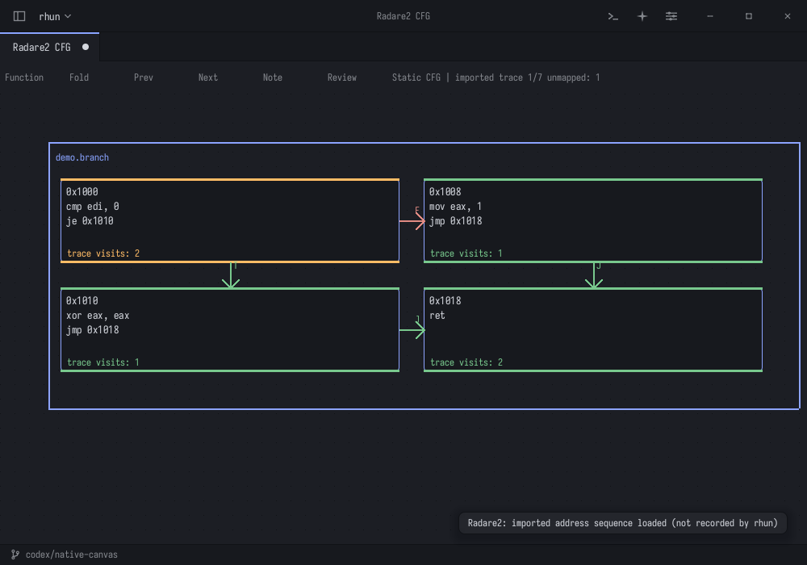

# Radare2 native analysis in rhun

The Radare2 tab projects a static control-flow graph into native function frames,
block rectangles, assembly text and bound arrows. It uses rhun's ASM canvas and
rasterizer; the external `r2` process supplies analysis JSON. Linux x86-64 is the
verified runtime. This is a bounded native CFG/review workflow, not the complete
Radare2 console, debugger or decompiler.



## Start with the demo

Build with `./build.sh`, launch `build/rhun .`, open the command palette
(**Ctrl+Shift+P**) and choose **Radare2: Open CFG Demo**. No r2 installation is
needed for this demo or JSON import. The fixture is
`examples/radare2/branch-demo.agfj.json`.

Each function gets a frame. Blocks show their address and up to 32 instructions;
complete source block JSON remains owned in the saved scene. Green T/J arrows
represent jump edges; red F arrows represent fall-through. Missing external
branch targets are retained in source metadata without creating phantom blocks.
Layout is a deterministic two-column grid, including cyclic graphs.

Middle drag pans, the wheel zooms, and clicks select blocks/text. **Function** or
**N** advances between source function frames; **Fold** or **F** collapses the
selected function without deleting its members. Review frames are skipped by
function navigation. Native font glyphs stay at screen size and assembly is
clipped to its block at small zoom; zoom in to read long blocks.

## Analyze a binary

Install Radare2 separately and make `r2` available in PATH, or launch rhun with
`RHUN_RADARE2=/absolute/path/to/r2 build/rhun .`. Its dependent libraries must also
be installed/available. The backend was tested against official Radare2 6.2.4.
It is not bundled in this repository.

Choose **Radare2: Analyze Binary Entry CFG**, then an existing local binary. The
fixed command is `aa;agfj @ entry0`. Analysis runs asynchronously, capped at
30 seconds and 8 MiB output; the result opens a separate tab. **Radare2: Cancel
Analysis** stops and reaps the child. Changing the project or source mtime
invalidates pending results. Startup scripts and plugins are disabled, and
inherited R2_ARGS is cleared so it cannot replace the fixed arguments.

For another function, use **Radare2: Analyze Function Address** from the result
and enter a decimal or `0x` address. It analyzes the same saved binary path.
Only numeric addresses are accepted; this field is not a Radare2 command prompt.
The analyzed binary is never launched, attached, debugged or opened writable.

**Radare2: Import agfj JSON** accepts one function array or JSON-lines arrays
(e.g. output of `agfj @@F`). Limits are 64 functions, 512 blocks total, 4096 scene
elements and 8 MiB input. Very large whole-program exports must be split into
smaller imports. Addresses accept current `addr` and legacy `offset` fields,
with exact unsigned integers limited to 2^53−1. Invalid imports keep existing tabs.

## Import and navigate a trace

Choose **Radare2: Import Address Trace**. Try
`examples/radare2/branch-demo.trace.json` with the demo. The closed input format is:

```json
{"type":"rhun-r2-trace","version":1,"binary":"Imported CFG","addresses":[4096,4112,4120,4096,4104,4120,99999]}
```

`binary` must exactly match the current analysis source: `Imported CFG` for JSON
imports/demo, or the absolute binary path for an analyzer result. The address
sequence is externally supplied evidence, not execution recorded by rhun. Match
its address base to the CFG (relocate an ASLR trace before importing). The source
path is a label, not cryptographic provenance. At most 8192 events and 1 MiB input
are accepted; unsupported fields/versions are rejected.

**Prev/Next** or **[ / ]** move through events in original order, retaining repeated
visits. Green bars and counts show derived block coverage; orange marks the
current event. Unknown or ambiguous overlapping block addresses are counted as
unmapped and do not invent coverage. Collapsing frames retains the evidence.
Import is one undoable edit; navigation, selection and folding do not dirty the
scene. Evidence stays in a `.rhun-canvas` save; the cursor restarts on reopening.

## Source-linked review

Select a block or its assembly text, choose **Note**, and enter a review note.
A separate Source review frame holds the note with the source block address and
native ID. Its creation is one undoable operation. Selecting a note also resolves
back to its source block. Remove linked notes before deleting their source block;
dangling review references are rejected by native validation.

**Review** / **Radare2: Export Review Markdown** saves displayed assembly, source-linked notes,
source path and trace evidence counts. Source/note text is indented as code, so
literal Markdown/HTML in a binary or note remains text. Export is a human review
record, not an automatic vulnerability verdict.

Open a ready Codex/OpenCode chat, return to the Radare2 tab, select relevant blocks
and choose **Radare2: Send Selected Blocks to Chat for Review** in the palette.
This explicit action sends bounded selected source context and trace summary
through the existing canvas proposal transport. The task asks for review and for
separating possible CFG branches from imported address evidence. It does not send
the entire binary or full trace automatically. Proposed scene changes use the
existing preview/accept workflow; responses are not applied automatically.

Save As with the `.rhun-canvas` suffix preserves assembly metadata, notes, arrows
and trace in native v6; older v1–v5 documents remain readable. Excalidraw export of
analysis scenes is refused because that format would lose analysis metadata and
cannot retain the source address identity contract.

## Verification

`sh tests/run.sh` includes frame, analyzer, trace/review, ACP transport and owned
lifecycle checks. For the actual backend smoke:

```sh
RHUN_REAL_RADARE2=/absolute/path/to/r2 python3 tests/radare-analysis.py
```

The actual test analyzes `/bin/true` read-only, saves/reopens its CFG and attaches
an imported trace plus a source-linked review note. Fake process tests cover literal
filenames, missing/failing/oversized/timeout jobs, cancel/shutdown reaping, changed
source and numeric command validation. The native model test performs 100
trace/cache/history cycles with zero live owned-byte growth.

Opt-in native Wayland/X11 checks include demo trace navigation:
`RHUN_CANVAS_NATIVE_SMOKE=1 python3 tests/canvas-native-smoke.py`.
macOS ARM64 canvas translation has existing blockers; Windows runtime/toolchain
verification is unavailable here. Neither platform is claimed to pass Radare2.
