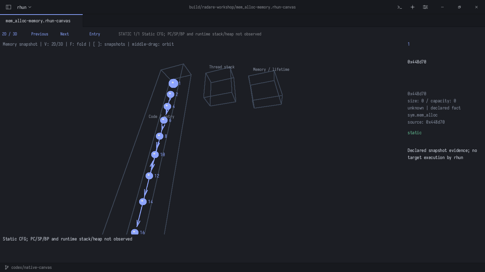
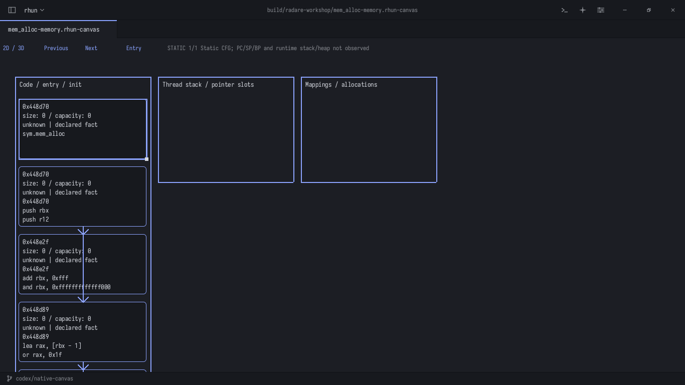

# Практикум: ваш бинарник rhun в Radare2 и нативном 2D/3D

Проверка выполнена 8 октября 2026 на Linux x86-64. Входной файл —
`/home/resu/Documents/dev/rhun/rhun`: статический ELF с отладочными символами.
SHA256: `adadf66d219a3e6757ab45a566b5a5e817c9d0effcef09161d912b3dc81d8e89`.
После проверки хеш не изменился. Этот файл сохранён отдельно от `build/rhun`.

Здесь разобраны все реализованные группы функций **Radare2/Memory**:
анализ, импорт, навигация, проекции, свёртки, снимки, заметки, ревью,
сохранение и обработка ошибок. Это инструкция к текущему интерфейсу.
Статический анализ не запускает исследуемый бинарник. Стек и куча живого процесса
автоматически не снимаются; ниже для них есть отдельный учебный сценарий.

## 1. Открыть готовый результат

В терминале:

```sh
cd /home/resu/Documents/dev/rhun
./tools/open-radare-workshop.sh
```

Откроется `build/radare-workshop/mem_alloc-memory.rhun-canvas`.
Если окно уже было открыто до подготовки материалов, перезапуск не обязателен:
раскройте в дереве проекта `build → radare-workshop` и откройте нужный файл.
Если `build` скрыт настройкой **Hidden in explorer**, используйте **Ctrl+O**
и полный путь либо команду запуска выше.

1. Щёлкните по холсту, чтобы фокус ушёл из текстового поля/чата.
2. Нажмите **V** или верхнюю кнопку **2D / 3D** — появится объёмная проекция.
3. Зажмите **среднюю кнопку мыши** и двигайте мышь — вращение.
4. Крутите колесо — приближение/отдаление.
5. Щёлкните узел — справа его адрес и сведения.
6. Нажмите **F** — весь сегмент выбранного узла свернётся; ещё **F** — раскроется.
7. Нажмите **N** или **Entry** сверху — сброс камеры. Это не переход к другой функции.
8. **V** возвращает 2D; средняя кнопка в 2D перемещает холст.

У статической проекции заполнен **Code / entry**, а **Thread stack** и
**Memory / lifetime** пусты: значения PC/SP/BP и состояние памяти не наблюдались.
Названия этих секций не означают, что rhun восстановил настоящую кучу.



Готовые документы находятся в `build/radare-workshop/`:

| Файл | Для чего открыть |
|---|---|
| `entry.rhun-canvas` | Реальный результат асинхронного анализа входа; хранит путь к бинарнику |
| `main.rhun-canvas` | CFG основной функции: 20 блоков |
| `app_init.rhun-canvas` | Инициализация приложения: 6 блоков |
| `mem_alloc.rhun-canvas` | Ветвления аллокатора: 8 блоков |
| `mem_free.rhun-canvas` | Освобождение: 5 блоков |
| `_start.rhun-canvas`, `sys_init.rhun-canvas` | По одному блоку инициализации |
| `*-memory.rhun-canvas` | Статическая проекция соответствующего CFG, переключаемая 2D/3D |
| `entry-reviewed.rhun-canvas` | Вход с ручной заметкой и явно синтетической последовательностью адресов |
| `entry-review.md` | Экспорт ассемблера и заметки в Markdown |
| `mem_alloc-review.json` | Ограниченный контекст выбранного объекта для ревью |
| `TEACHING-lifecycle.rhun-canvas` | Учебные снимки стека/кучи, не захват этого ELF |
| `manifest.json` | SHA256, версия r2, адреса, размеры графов и пройденные проверки |
| `*.agfj.json`, `*.log` | Сырой вывод r2 и протоколы проверок |

Чтобы открыть другой результат через терминал:

```sh
./tools/open-radare-workshop.sh build/radare-workshop/main.rhun-canvas
```

## 2. Самостоятельно проанализировать вход и нужную функцию

Локально подготовлен r2 6.2.4 в `build/radare2-runtime/`, без установки в систему.
Скрипт запуска выше подключает его автоматически. Папка `build` игнорируется Git;
на другом компьютере понадобится отдельно установить r2 или распаковать его пакет.
Для собственного r2 задайте `RHUN_RADARE2=/полный/путь/r2` перед запуском;
его динамические библиотеки тоже должны быть доступны.

**Каждый пункт с названием команды:** нажмите **Ctrl+Shift+P**, введите название,
выберите его и нажмите **Enter**. В появившемся поле вводите путь/адрес, затем Enter.

1. **Radare2: Analyze Binary Entry CFG**.
2. Введите `/home/resu/Documents/dev/rhun/rhun`, Enter.
3. Дождитесь **CFG ready** и новой вкладки. Интерфейс во время анализа доступен.
4. Здесь виден `entry0`: подготовка RSP, вызов `sys_init`, затем `main`, выход.
   Исходный код этого перехода — `src/start.s`.
5. На **этой вкладке** выполните **Radare2: Analyze Function Address**.
6. Введите адрес из таблицы. Откроется отдельный CFG той же программы.

| Функция | Адрес именно этого ELF | Что смотреть |
|---|---|---|
| `_start` | `0x454810` | Начальный RSP, порядок вызовов инициализации |
| `sys_init` | `0x454830` | Разбор начального окружения процесса |
| `main` | `0x448720` | Инициализация, выбор оконного backend, основной цикл |
| `app_init` | `0x4049f0` | Инициализация приложения |
| `mem_alloc` | `0x448d70` | Свободные списки, выделение чанка, большая mmap-ветка |
| `mem_free` | `0x448ee0` | Возврат в свободный список либо освобождение mapping |

После пересборки адреса могут измениться. Актуальные адреса: `nm -n rhun`;
повторная подготовка практикума обновляет `manifest.json`.

Важно: готовые тематические `main.rhun-canvas` и остальные именные CFG созданы
импортом `.agfj.json`; их источник называется **Imported CFG**. Для повторного
анализа адреса используйте `entry.rhun-canvas` либо новый результат живого анализатора:
именно они хранят полный путь к ELF. Проекция нескольких функций не строит
автоматически граф вызовов между ними; её стрелки отражают переходы внутри функций.

## 3. Читать CFG, перемещаться и сворачивать функции

На вкладке CFG:

- Средняя кнопка + движение — перемещение; колесо — масштаб.
- Щелчок по блоку или тексту — выбор исходного блока.
- **N / Function** — следующая функция; в документе с одной функцией вернёт к ней.
- **F / Fold** — свернуть/раскрыть выбранную функцию. Исходные блоки сохраняются.
- Зелёные T/J — переход; красные F — fall-through.
- В блоке отображается до 32 инструкций. Полный JSON блока хранится в документе.

Для импорта: **Radare2: Import agfj JSON** → например полный путь к
`build/radare-workshop/mem_alloc.agfj.json` → Enter.
Это работает без установленного r2. В одном импорте максимум 64 функции,
512 блоков и 8 MiB JSON; большой бинарник разбирайте частями.

## 4. Перевести CFG в 2D/3D и сохранить

1. Сделайте активной вкладку нужного **CFG**.
2. **Radare2: Project CFG to Entry Stack Heap**.
3. В новой вкладке осмотрите карточки кода. Щелчок выбирает карточку.
4. **V** — 3D, средняя кнопка — вращение, колесо — масштаб.
5. **F** сворачивает сегмент выбранного объекта. Можно также выбрать заголовок
   сегмента в 2D. Внешние связи сохраняют исходные индексы; внутренние временно скрыты.
6. **V** сохраняет выбранный сегмент и свёртки при переходе между представлениями.
7. Для выбора с клавиатуры: **Radare2 Memory: Select Next Object** через палитру.
8. **Ctrl+Shift+S** → путь с расширением `.rhun-canvas` → Enter.
9. Откройте сохранённый файл заново: данные сохранятся, камера/выделение/свёртки
   сбросятся. В снимках курсор тоже начнётся с первого кадра.

Статическая проекция ограничена 256 объектами: функция и её блоки считаются
отдельными объектами. Ввод целого огромного бинарника одной сценой здесь не нужен.
Экспорт в Excalidraw для Memory отклоняется: этот формат не сохраняет её данные.



## 5. Стек, куча, free и повторное использование адреса

1. **Radare2: Open Entry Stack Heap Demo**.
2. Вверху будет отметка учебных данных. Это модель из
   `examples/memory/rhun-lifecycle.rhun-memory`, а не измерения вашего процесса.
3. Нажимайте **] / Next**; **[ / Previous** возвращает назад.

| Кадр, начиная с нуля | Что показывает модель |
|---|---|
| 0 | Начальный стек |
| 1 | `_start` / `sys_init` |
| 2 | `main` / `app_init` |
| 3 | Цикл событий |
| 4 | `H1`: запрос 64 байта, слот 128, указатель `buf` |
| 5 | Рабочий стек и дополнительный указатель `p` |
| 6 | `H1` освобождён, ссылка `buf` стала висячей — красная стрелка |
| 7 | Новый объект `H2` по прежнему адресу; старое поколение `H1` отдельно |
| 8 | Завершение |

На кадре 5 выберите карточку стека, **F**, **V**, **F**: свёртка переносится между
2D и 3D, раскрытие возвращает исходные объекты. Переход к другому кадру сбрасывает
свёртки и выделение, но сохраняет камеру.

Свои снимки: **Radare2: Import Memory Snapshots** → файл `.rhun-memory`.
Контракт данных и ограничения: [radare2-memory.md](radare2-memory.md).
Объекты, регистры и время жизни должен предоставить внешний сборщик.

Для проверки декодера заголовка той же командой импортируйте
`/home/resu/Documents/dev/rhun/examples/memory/captured-header.json`.
Это **пример заголовка**, а не дамп из вашего процесса. Размер/класс определяются,
но состояние останется `unknown`: заголовок после free сам по себе не доказывает
живость блока. Аллокатор rhun имеет собственный 16-байтовый заголовок, не glibc malloc.

## 6. Последовательность адресов и покрытие

1. Откройте `entry.rhun-canvas`.
2. **Radare2: Import Address Trace** → полный путь к
   `build/radare-workshop/entry-SYNTHETIC.trace.json` → Enter.
3. **] / [** переключают события. В этом примере два обращения к одному блоку.
4. Покрытие и текущая позиция отображаются поверх CFG; свёртка их не удаляет.

Этот файл специально синтетический для проверки интерфейса. Реального запуска
бинарника и трассировки не было. Для ветвлений и неизвестного адреса удобнее
**Radare2: Open CFG Demo**, затем импорт
`examples/radare2/branch-demo.trace.json`: 7 событий, одно не сопоставлено.
Привязка `binary` должна совпасть: абсолютный путь ELF для анализа либо
`Imported CFG` для импортированных CFG. Внешний ASLR-трейс сначала нужно привести
к адресной базе CFG. Не переименовывайте синтетический маршрут в реальную трассу.

## 7. Ручное и агентное ревью

**Заметка и Markdown:**

1. На CFG щёлкните по **блоку или его ассемблерному тексту**.
2. **Radare2: Add Source Review Note**, введите замечание, Enter.
3. Появится отдельный фрейм заметки с привязкой к адресу исходного блока.
4. **Ctrl+Z** отменяет заметку целиком, **Ctrl+Shift+Z** возвращает её.
5. **Radare2: Export Review Markdown** → полный путь к новому `.md` → Enter.

**Memory JSON:** выберите конкретный объект в Memory →
**Radare2 Memory: Export Selected Review JSON** → путь `.json`.
Свёрнутый сегмент сначала раскройте и выберите объект: сводная карточка не является
исходным объектом для ревью. Без выбора экспорт отклоняется.

**Отправка агенту, когда нужен его разбор:**

1. **Chat: New OpenCode Conversation** либо **Chat: New Codex Conversation**.
2. Дождитесь готовности провайдера; локальный CLI должен быть установлен и настроен.
3. Верните фокус на CFG/Memory и выберите нужный блок/объект.
4. Для CFG: **Radare2: Send Selected Blocks to Chat for Review**.
   Для Memory: **Radare2 Memory: Send Selected Evidence to Ready Chat**.
5. Проверьте переданный контекст и ответ в чате. Готовое выделение ограничивает объём
   отправляемых данных; это не отправка всего бинарника.

В проверках использован тестовый ACP-провайдер: проверена доставка структурированного
запроса. Реальный облачный ответ/вердикт модели для этого ELF не запрашивался.
Ответ агента не становится автоматически доказательством или правкой графа.

## 8. Что делать при ошибке

| Ситуация | Действие |
|---|---|
| `executable missing` | Запустить через скрипт практикума либо задать корректный `RHUN_RADARE2` |
| Анализ нужно остановить | **Radare2: Cancel Analysis**; существующие вкладки сохраняются |
| Анализ дольше 30 секунд / больше 8 MiB | Разбирать отдельную функцию; зависший процесс завершается |
| Бинарник изменён во время анализа | Запросить анализ снова; старый результат отклоняется |
| Адрес не принимается | Ввести только число, например `0x448d70`; команды r2 в этом поле не выполняются |
| Пустой стек/куча в статическом графе | Это ожидаемо; импортировать реальные снимки или открыть учебное демо |
| F или V ничего не делает | Щёлкнуть по холсту; для F сначала выбрать объект/сегмент |
| Ревью не экспортируется | Выбрать исходный блок/объект; раскрыть сегмент; использовать доступный путь |
| Неверный импорт | Исходная сцена сохраняется; сверить схему, IDs, адреса и лимиты |

## 9. Повторить автоматическую проверку

```sh
cd /home/resu/Documents/dev/rhun
RHUN_RADARE2="$PWD/build/radare2-runtime/usr/bin/r2" \
LD_LIBRARY_PATH="$PWD/build/radare2-runtime/usr/lib" \
python3 tools/radare-workshop.py ./rhun --native
```

Без графического окружения уберите `--native`. Скрипт использует текущий
`build/rhun` как анализатор/просмотрщик и `./rhun` как исследуемый ELF;
сам ELF он не запускает. Для другого бинарника rhun можно передать иной путь,
но нужны символы `_start`, `sys_init`, `main`, `app_init`, `mem_alloc`, `mem_free`.
Если просмотрщик ещё не собран — сначала `./build.sh`.

Результаты генерируются заново в игнорируемой Git папке `build/radare-workshop`;
набор файлов и адреса доступны в manifest. Подготовленный локальный r2 не входит
в репозиторий. Коммитятся инструмент и инструкция, входной бинарник остаётся вашим.

Дополнительно прошли 57 регрессионных тестов из `tests/radare-*.py` и
`tests/memory-*.py`: ошибки/отмена/изменение ELF, атомарность импорта,
свёртки и исходные связи, снимки, форматы, ревью и ACP-транспорт.
Конкретный список: radare-frames, radare-analysis, radare-trace-review,
radare-chat-request, memory-contract, memory-view, memory-graph, memory-fold,
memory-adapter, memory-review, memory-chat-request. Полный набор несвязанных
тестов IDE в этой проверке не повторялся.

Также на этом ELF прошли живые проверки Wayland и X11: загрузка статической
проекции, выбор, свёртка/раскрытие, 2D/3D, вращение средней кнопкой, масштаб и сброс
камеры. Снимки в инструкции получены из окна Wayland. Этап подготовки инструментов
зафиксирован коммитом `80eac47`; следующий этап добавляет живую приёмку и эту инструкцию.
